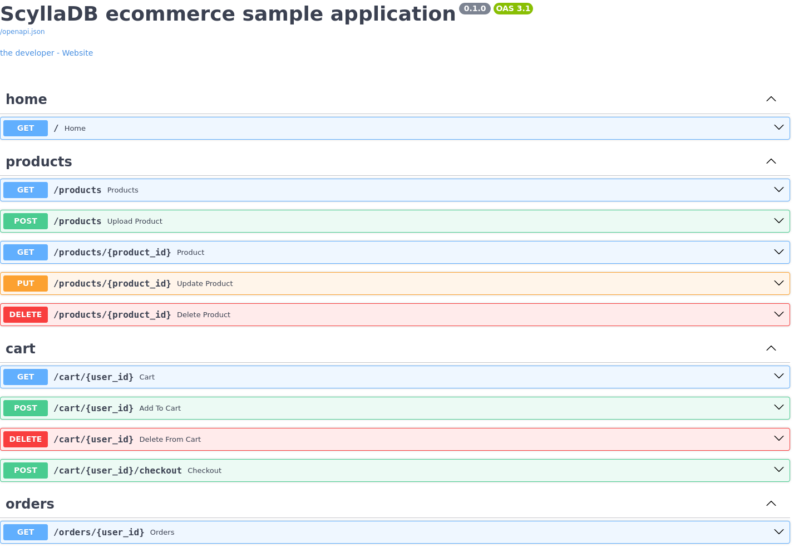

# Ecommerce API - ScyllaDB & Python sample application
This is a sample ecommerce application built with [ScyllaDB](https://www.scylladb.com/), [FastAPI](https://fastapi.tiangolo.com/) and [Streamlit](https://docs.streamlit.io/).


## Prerequisites
* [CQLSH](https://cassandra.apache.org/doc/stable/cassandra/tools/cqlsh.html)
* Python 3

## Get started

Clone the repository:

```
git clone https://github.com/zseta/scylla-uni-live-q3-2025
cd shopping-cart
```

## Create database schema

Connect to your ScyllaDB cluster using CQLSH and create the schema:

```
docker exec -it node1 cqlsh
```

```
CREATE KEYSPACE IF NOT EXISTS ecommerce WITH replication = { 'class': 'NetworkTopologyStrategy', 'replication_factor': '3' };

CREATE TABLE ecommerce.product (
    id UUID,
    name TEXT,
    price FLOAT,
    img TEXT,
    PRIMARY KEY (id)
);

CREATE TABLE ecommerce.cart (
    user_id TEXT,
    cart_id UUID,
    is_active BOOLEAN,
    PRIMARY KEY (user_id, cart_id)
);
CREATE INDEX cart_is_active ON ecommerce.cart ((user_id), is_active);

CREATE TABLE ecommerce.cart_items (
    user_id TEXT,
    cart_id UUID,
    product_id UUID,
    product_quantity INT,
    PRIMARY KEY (user_id, cart_id, product_id)
);
```

## Set up API server

Create a new virtual environment:
```
virtualenv env
source env/bin/activate
```

Install Python requirements (FastAPI with Uvicorn server, ScyllaDB driver, Streamlit):
```
pip install -r requirements.txt
```

Modify `config.py` to match your database credentials:

```python
HOST="172.18.0.4"
USER="scylla"
PASSWORD=""
DATACENTER="datacenter1"
KEYSPACE="ecommerce"
```

> [!TIP]
> Use the `docker inspect -f '{{range .NetworkSettings.Networks}}{{.IPAddress}}{{end}}' node1` command to get the ScyllaDB HOST address.

Run the server:
```
python server.py
```

Visit API docs: http://127.0.0.1:8000/docs



## Generate sample data

Insert products to the database:
```bash
cqlsh <ip_address>
COPY ecommerce.product (id, img, name, price) FROM 'product.csv' with HEADER = TRUE;
```

Generate user interactions (add products to cart and checkout - continously):
1. Run the API server:
    ```
    python server.py
    ```
1. Run the python script:
    ```bash
    python generate_requests.py
    ```
    ```
    Shopping started - User(6773b120-8499-4196-9df8-2c4a60b6f1ac) 
    (1) Added to cart: abe0e6dc-6ad1-4c3e-8127-80c6176ce99a 
    (2) Added to cart: ee9b125d-c92f-4555-bdb3-35aa260b6f91 
    (3) Added to cart: 2bf36d87-9b36-4bd3-a44a-8d167e189ce6 
    (4) Added to cart: 0c38b0c8-a792-4128-bff9-64c527366202 
    (5) Added to cart: 609ed832-e565-4f46-830b-5fabc120e1d4 
    Checkout completed (5 items)! 
    -----
    (1) Added to cart: e8ce5e13-0a7e-4e6e-8858-252f5b1cb1db 
    (2) Added to cart: 3a33f31b-b37c-413e-81a5-1f4b42cedcf6 
    (3) Added to cart: ffa5f74c-26f2-4342-a6f4-ee2338dd205f 
    (4) Added to cart: ef281712-2169-49e4-880a-8da503b0b6de 
    (5) Added to cart: 1e8abb0c-f558-433c-a8c8-e029f12c0d7d 
    (6) Added to cart: 609ed832-e565-4f46-830b-5fabc120e1d4 
    Checkout completed (6 items)! 
    -----
    (1) Added to cart: 0015b10c-0842-4796-840a-2e43a6a719d3 
    (2) Added to cart: abe0e6dc-6ad1-4c3e-8127-80c6176ce99a 
    (3) Added to cart: 0c38b0c8-a792-4128-bff9-64c527366202 
    Checkout completed (3 items)! 
    -----
    ```
    You can run this script from multiple terminals to generate more data.
 